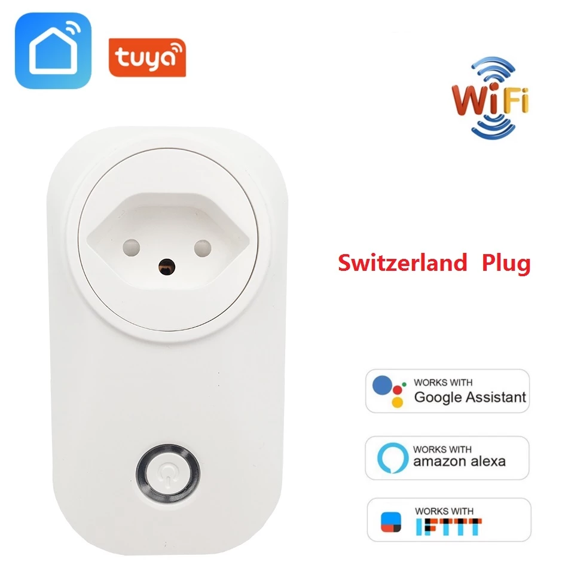
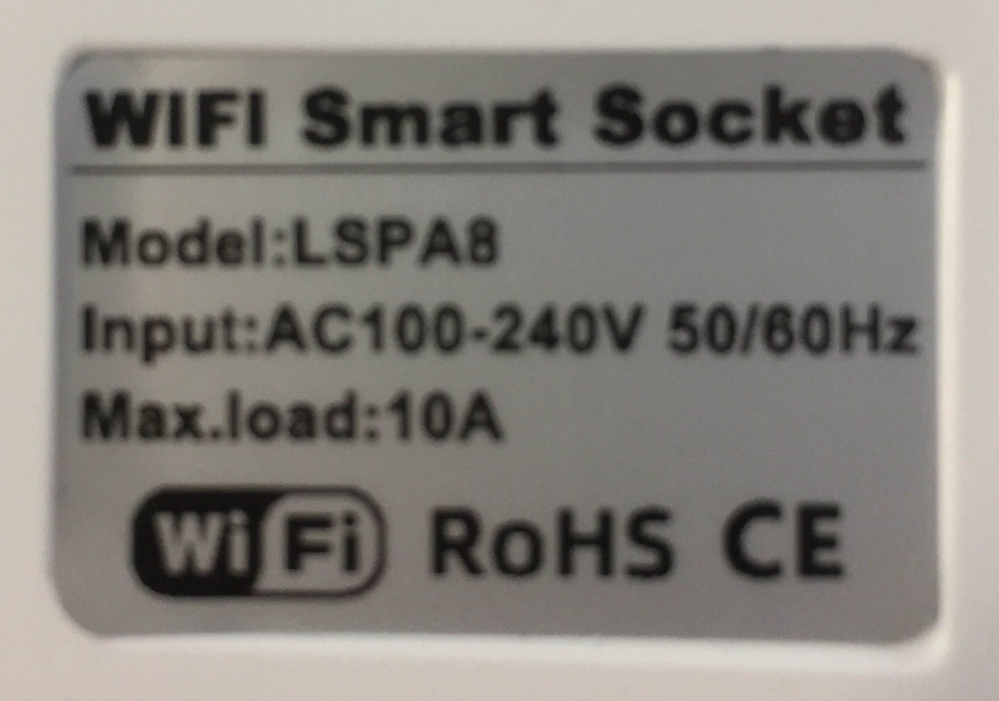
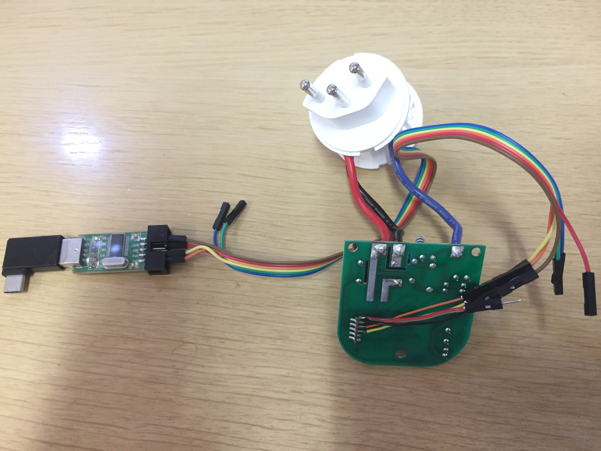
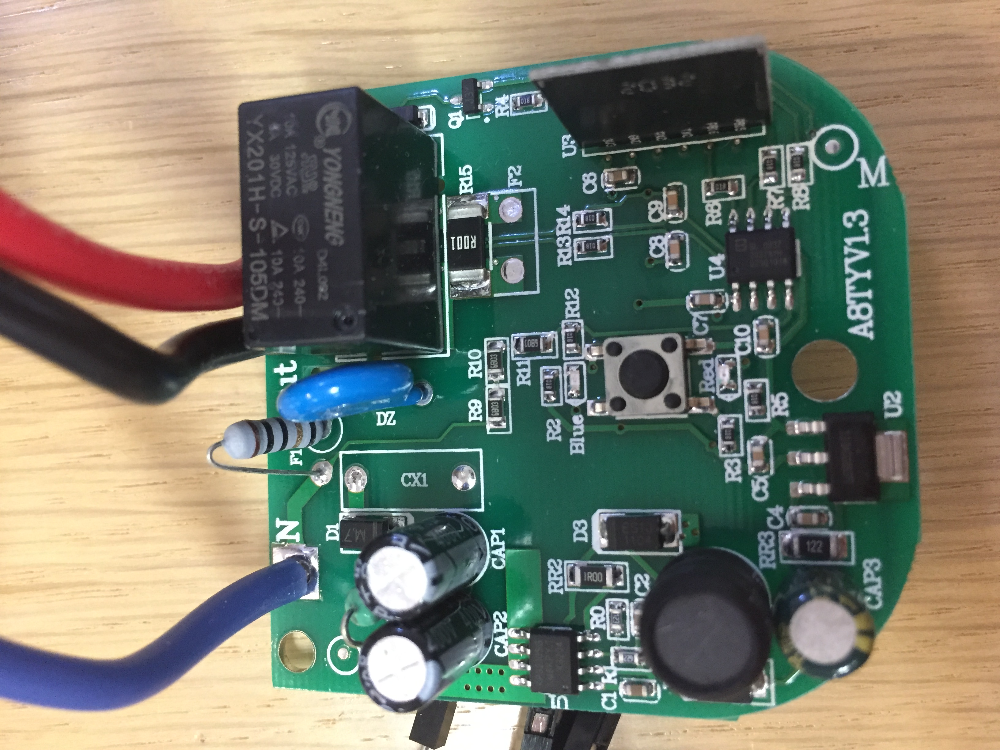
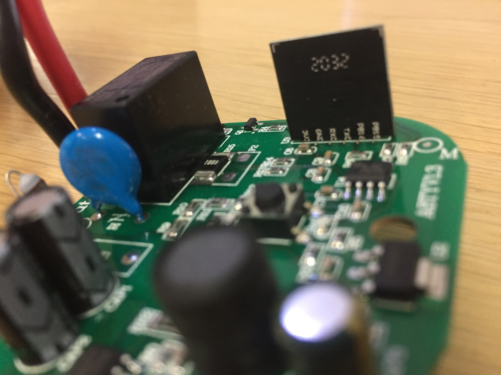

# TUYA WiFi Smart Socket












## UART Logs

Turn on a new device:

```
< TUYA IOT SDK V:2.0.0 BS:30.01_PT:2.2_LAN:3.3_CAD:1.0.1_CD:1.0.0 >
[FW]: TC0025_TW02_PLUG_16DLTJL1_P0 | [HW]: TW02_V2.0 | [SW]: V1.4.2 (Nov 28 2019 14:47:57) | [PID]: zmuquaytzuth4gkp
[01-01 00:00:00 TUYA Notice][hw_table.c:354] wifi status is :0
[01-01 00:00:04 TUYA Notice][tuya_main.c:143] wf_assign_ap_scan failed(-606)
[01-01 00:00:04 TUYA Notice][gw_intf.c:2270] gw_cntl.gw_wsm.stat:0
[01-01 00:00:04 TUYA Notice][app_dltj.c:236] have not storage ele data:-901
[01-01 00:00:04 TUYA Notice][tuya_device.c:463] device_init ok  free_mem_size:89904
[01-01 00:00:04 TUYA Info][wifi_hwl.c:1261] Low Power Mode
[01-01 00:00:05 TUYA Notice][hw_table.c:354] wifi status is :0
[01-01 00:00:40 TUYA Notice][hw_table.c:415] port: 3
[01-01 00:01:31 TUYA Notice][hw_table.c:415] port: 3
```

Switching to discovery mode (fast blue blinking), and pairing with SmartLife iPhone application:

```
[01-01 00:00:01 TUYA Notice][hw_table.c:354] wifi status is :1
 set listen mode
w600 special mode
w600 b lock channel: 6, 5, 0
sort_rev_data: 0x00a7 0x008c 0x0170 0x0175 0x0174 0x0169
sort_rev_data: 0x00ae 0x0080 0x010c 0x0169 0x0168 0x0161
sort_rev_data: 0x0095 0x0084 0x016b 0x0154 0x0166 0x0146
sort_rev_data: 0x00bd 0x0085 0x0130 0x0148 0x0131 0x0149
sort_rev_data: 0x00d6 0x0088 0x0169 0x0165 0x0164 0x015f
sort_rev_data: 0x00b6 0x008d 0x016e 0x0167 0x0100 0x0100
sort_rev_data: 0x00ba 0x0082 0x0172 0x0165 0x0161 0x016d
sort_rev_data: 0x00bd 0x008b 0x015f 0x0143 0x016f 0x016d
sort_rev_data: 0x00fd 0x0083 0x0131 0x010e 0x0145 0x0155
sort_rev_data: 0x00e6 0x0081 0x0176 0x0165 0x0161 0x0164
sort_rev_data: 0x00c6 0x0086 0x0138 0x0169 0x0139 0x0178
sort_rev_data: 0x00b9 0x0089 0x0150 0x0161 0x0172 0x0161
[01-01 00:03:00 TUYA Notice][gw_intf.c:471] stop smt cfg mthd:1
[01-01 00:03:00 TUYA Notice][gw_intf.c:474] lowpower or special mode stop tmm_short and tmm_long timer
[01-01 00:03:00 TUYA Info][wifi_hwl.c:1261] Low Power Mode
[01-01 00:03:00 TUYA Notice][hw_table.c:354] wifi status is :0
[01-01 00:03:24 TUYA Notice][hw_table.c:415] port: 3
```

Turn off and back on:

```
< TUYA IOT SDK V:2.0.0 BS:30.01_PT:2.2_LAN:3.3_CAD:1.0.1_CD:1.0.0 >
[FW]: TC0025_TW02_PLUG_16DLTJL1_P0 | [HW]: TW02_V2.0 | [SW]: V1.4.2 (Nov 28 2019 14:47:57) | [PID]: zmuquaytzuth4gkp
[01-01 00:00:00 TUYA Notice][hw_table.c:354] wifi status is :2
[01-01 00:00:00 TUYA Notice][gw_intf.c:2270] gw_cntl.gw_wsm.stat:1
[01-01 00:00:00 TUYA Notice][app_dltj.c:236] have not storage ele data:-901
[01-01 00:00:00 TUYA Notice][tuya_device.c:463] device_init ok  free_mem_size:89920
[01-01 00:00:01 TUYA Notice][hw_table.c:354] wifi status is :2
[01-01 00:00:00 TUYA Notice][wifi_hwl.c:1316] 
                                               old mode is 4 

[01-01 00:00:01 TUYA Notice][hw_table.c:354] wifi status is :1
 set listen mode
[01-01 00:00:01 TUYA Notice][hw_table.c:354] wifi status is :2
[01-01 00:03:00 TUYA Notice][wifi_hwl.c:1316] 
                                               old mode is 4 

[01-01 00:03:00 TUYA Notice][gw_intf.c:518] stop smt cfg mthd:1
[01-01 00:03:00 TUYA Notice][hw_table.c:354] wifi status is :5
[01-01 00:03:00 TUYA Notice][gw_intf.c:521] lowpower or special mode stop tmm_short and tmm_long timer
[01-01 00:03:00 TUYA Info][wifi_hwl.c:1261] Low Power Mode
[01-01 00:03:01 TUYA Notice][hw_table.c:354] wifi status is :0
```

Created `SmartLife-A971` wireless access point.

